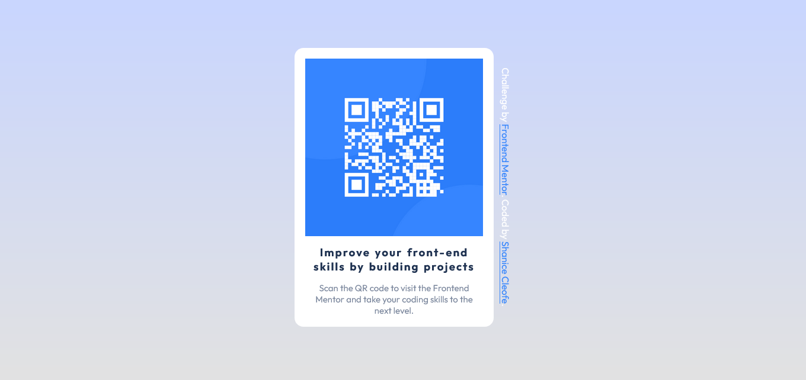

#  Frontend Mentor - QR code component solution

  

This is a solution to the [QR code component challenge on Frontend Mentor](https://www.frontendmentor.io/challenges/qr-code-component-iux_sIO_H). Frontend Mentor challenges help you improve your coding skills by building realistic projects.

  

##  Table of contents


-  [Overview](#overview)
	- [Screenshot](#screenshot)
	- [Links](#links)
-  [My process](#my-process)
	- [Built with](#built-with)
	- [What I learned](#what-i-learned)
	- [Continued development](#continued-development)
	- [Useful resources](#useful-resources)
-  [Author](#author)
-  [Acknowledgments](#acknowledgments)


##  Overview
###  Screenshot


  

###  Links
- Solution URL: [Solution](https://github.com/sdacleofe/qr-code-frontend)
- Live Site URL: [QR Code Layout](https://sdacleofe.github.io/qr-code-frontend/)

  

##  My process

  

###  Built with

  

- Semantic HTML5 markup

- CSS custom properties

- Flexbox

  

###  What I learned

While working through this project, I have used HTML5 semantics such as `<article>` and `<section>` tags instead of `<div>` tag to make my code easier to read and stay current with coding. Plus, I spent my day to study CSS flexbox, and was able to use it in this project.

Code using HTML5 semantics
``` html
<article>
	<section  class="card">
		
		<h3>Improve your front-end skills by building projects</h3>
		<p>Scan the QR code to visit the Frontend Mentor and take your coding skills to the next level.</p>
	</section>
	<section  class="attribution">
		Challenge by <a  href="https://www.frontendmentor.io?ref=challenge"  target="_blank">Frontend Mentor</a>. Coded by
		<a  href="https://github.com/sdacleofe">Shanice Cleofe</a>.
	</section>
</article>
```

This is how I vertically align my attribution text with CSS property
```css
section.attribution  {
	writing-mode:  vertical-rl;
	text-orientation:  mixed;
	color:  hsl(0,  0%,  100%);
	padding-left:  10px;
}

```
This is how I used flexbox properties in my CSS custom
```css
article  {
	display:  flex;
	align-items:  center;
	justify-content:  center;
	height:  calc(100vh  -  10px);
}

section.card  {
	display:  flex;
	flex-direction:  column;
	
	text-align:  center;
	width:  300px;
	padding:  18px;
	background-color:  hsl(0,  0%,  100%);
	border-radius:  15px;
}
```

###  Continued development
In the future projects, I would like to focus on using the CSS custom properties. Especially the CSS layout part in which it covers the flexbox, grid and float. Learning the depth of its concept will help me to be more comfortable and confident in coding and reading the source code.

###  Useful resources

 - [How to ACTUALLY Master CSS?](https://www.youtube.com/watch?v=6XGCCxiIUYc&t=306s) - This video helped me to narrowed my thoughts on the things I needed to know in order to truly understand CSS.

-  [The Ultimate CSS3 Flexbox Tutorial - Colt's Code Camp](https://www.youtube.com/watch?v=qZv-rNx0jEA) - This video helped me  to understand the CSS Flexbox. I like his style of teaching, its a quality content.  There were little challenges throughout his video, and overall it's awesome!

-  [MDN Web Docs](https://developer.mozilla.org/) - This is an amazing website for extensive set of learning resources. A great reference for different aspects of web development. Provides detailed information about what you need in web standards
  

##  Author

- Frontend Mentor - [@sdacleofe](https://www.frontendmentor.io/profile/sdacleofe)

- Twitter - [@sdacwd](https://twitter.com/sdacwd)
 
##  Acknowledgments
These are the YouTube content creators  whose videos I found to be incredibly useful. [Codedamn](https://www.youtube.com/c/codedamn) | [Colt Steele](https://www.youtube.com/c/codedamn) | [Coder Coder](https://www.youtube.com/c/TheCoderCoder) 